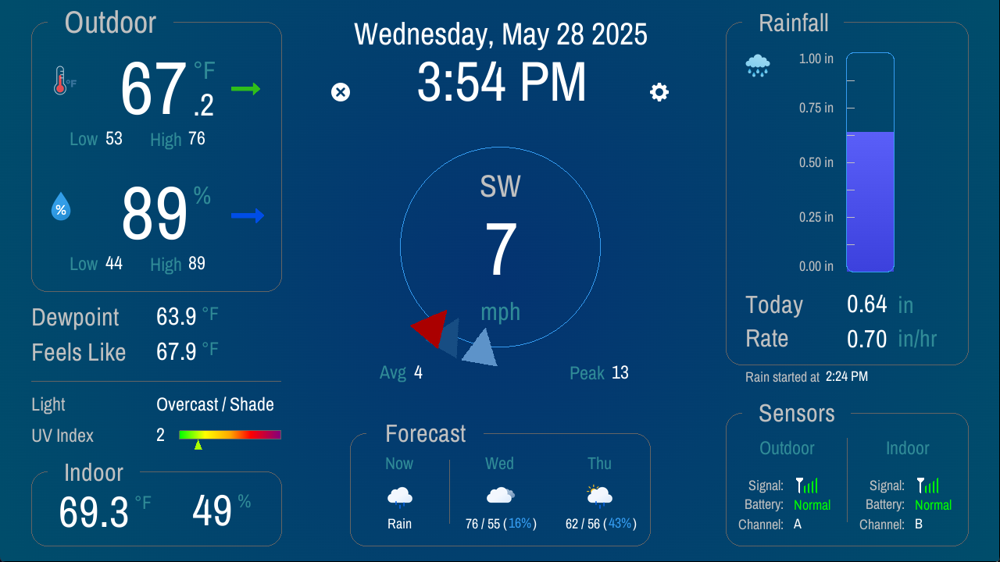

# DragonWx

DragonWx is a weather display app that receives live telemetry from nearby Home Weather Station sensors using an SDR receiver connected to a computer.

 

	
<i>DragonWx's Main Interface</i>

 

### What You Will Need

- Computer running either Windows or Linux.
- A functional install of [rtl_433](https://github.com/merbanan/rtl_433), which is an open-source SDR data receiving tool that does all the "heavy lifting" in terms of tuning a compatible SDR in to receive the pings from weather sensors, and then decodes them into useful human-readable output. Without this tool, my weather app is basically an empty display  thats nice to look at. ;-)
- An SDR tuner compatible with rtl_433. 
I've had good luck with the inexpensive [nooelec](https://www.nooelec.com/store/sdr/sdr-receivers/nesdr-smartee-sdr.html) dongles, though any of the RTL-SDR variants should work fine. There are also builds of rtl_433 that include the [SoapySDR](https://github.com/pothosware/SoapySDR/wiki) driver which adds additional support for some of the nicer SDRs like the [SDRplay](https://www.sdrplay.com/products/) receivers.
- A supported wireless weather sensor. 
This is what performs the actual measurements and then transmits your telemetry to be received by the SDR. **To get the most out of my app, I'd recommend using one that can measure wind and rainfall in addition to the usual temperature and humidity readings.** I know for sure that the [Acurite](https://www.acurite.com/collections/sensors) and [Ambient](https://ambientweather.com/outdoor-weather-sensors) weather sensors work, but again, visit the rtl_433 project page for more in depth information on supported sensors.
- (Optional) A second sensor for <b>Indoor</b> temperature and humidity information. 
<i>Unlike the original/factory weather station displays, our computers/screens do not have a built sensor to measure the indoor temperature and humidity, so I decided the best way to replicate this functionality was to use a second external sensor. The smaller temperature/humidity-only sensors are usually be pretty inexpensive.</i>

## Setup Instructions

### Confirm Your SDR / rtl_433 Setup Works

Before using DragonWx, I recommend verifying that you have a working rtl_433 setup by running it first in a terminal to make sure it sees your SDR of choice and is receiving telemetry. rtl_433 can receive and decode a wide range of wireless devices so you'll probably see telemetry from more than just weather stations! It really is a powerful tool! If you are having trouble receiving the pings from your weather station, you may need to tweak/adjust the gain settings of your SDR, but that's beyond the scope of this document. Please check out the [rtl_433](https://github.com/merbanan/rtl_433) GitHub page for more in-depth instructions/information on setting it up. Once you are receiving good telemetry, note the ID number of YOUR specific Outdoor sensor (and Indoor sensor if you have one). These IDs will be required during the DragonWx setup process described below.

A simple example, for reference, of using an SDRplay as the device (via SoapySDR) and with a gain setting of 5 dB:
<pre>rtl_433-rtlsdr-soapysdr.exe -d driver=sdrplay -g5</pre>

 

	
<i>Example output from rtl_433 running successfully in the terminal</i>

 

### Launch DragonWx

The first time you launch DragonWx, you should get a welcome message that directs you on how to enter Setup Mode. Click anywhere on the screen to dismiss the message and then click the "Gear" icon. Here you will need enter in the Sensor IDs for your sensor(s) you are using as well as the full filepath to your rtl_433 executable.

<b>NOTE:</b> Windows clients are able to paste text into fields from the clipboard by left-clicking on a field to select it, and then right-clicking on it to do the paste. This is especially useful for long text fields like the "Exec Path" etc. I hope to support pasting from a Linux clipboard in a future version.

#### Setup Required Fields

- Sensor ID(s) corresponding to your Outdoor and/or Indoor weather sensor(s). (These IDs can be found while running rtl_433 directly in a terminal as described above.)
- Path to your rtl_433 executable
- Potentially additional command-line arguments for rtl_433 if your specific SDR requires it (Example: "-d driver=sdrplay" for SDRplay SDRs)

#### Optional Settings

- Custom gain value for your SDR to use
- Temperature and/or Humidity calibration offsets for each sensor
- Toggle between Metric and Imperial units
- Location for internet-based forecast info (in latitude/longitude decimal degrees)

When you are finished, click the OK button. The program will warn you that rtl_433 must be started for changes to take effect. Click anywhere to dismiss the message and then click "Start RTL433". That should launch the rtl_433 tool in the background which will start looking for your weather sensor telemetry. Click OK again to exit the Setup screen and you should be good to go!

For convenience, you may also configure DragonWx manually by editing `DragonWx.conf`, which is just a plain-text file. The parameters should be pretty self-explanatory.

### Using DragonWx

Once you have successfully configured DragonWx and it is receiving telemetry from rtl_433, the info on the screen should update every time it receives a new ping from your sensor(s). The time between those pings varies between companies and even specific models, but it's usually between 15 to 45 seconds. The "Sensors" panel in the bottom-right corner will show you useful information regarding the current state of your sensor(s) such as battery condition, signal reliability, and the channel it's being received on. If your SDR misses a ping from one of your sensors, it's corresponding Signal Reliability meter will go down by a bar each time. When a new ping is successfully received, it goes back up by a bar in the same way until it's full and turns GREEN.

There are also a few clickable areas on the screen that can give you additional information or display options:

- Click the "Feels Like" label to have it instead show which method is being used to calculate the feels-like temperature. (Wind Chill, Heat Index, Steadman Apparent Temperature, or just the ACTUAL current outdoor temperature). Clicking on it again will revert back to the "Feels Like" catch-all label.
- Click the current Wind Direction to toggle between Cardinal direction labels (like E, NNW, SW etc) and decimal degrees.
- If your weather station has a Light Intensity sensor, you can click on the verbal description of how bright it is outside (Overcast, Direct Sun, Twilight, etc) to display the actual value measure in Lux. Clicking again will revert back to the verbal description.

### Errors

- **DragonWx encountered a problem during launch**
  
If you are getting this error message on startup, it's because DragonWx cannot find (or access) one or more of the required graphical assets that should have been bundled with the program. These images/fonts all need to be in their respective directories alongside the executable. The error screen will also have a list of which specific assets could not be found (or accessed) and an "error.log" text file will be generated and saved in the same directory as your DragonWx program file.
 

- **Could Not Run rtl_433 Executable:**
  
Whenever you run DragonWx, it automatically tries to launch the rtl_433 program into the background which is needed for communication with your SDR. If the path you specified to that executable is invalid or can't be found, you will get this error message. Double-check your "Exec Path" is correct in the settings (and that your user has privileges to access/execute it if you are running under linux).

### Warnings

- **Fullscreen Resolution:**
  DragonWx tries to run in Fullscreen Mode by default, however if your effective screen resolution is not 1280 x 720, the app will be forced into Windowed Mode and you will get a warning about it. This is because DragonWx currently uses a fixed-pixel layout based around that specific resolution. In future versions, I hope to switch to an adapative layout to solve this problem. (To suppress this warning message in the future, disable Fullscreen Mode in either the app settings or in the config file.)
 

- **rtl_433 Must Be Restarted:**
  
DragonWx passes all of your SDR-specific settings directly to the rtl_433 program at startup and cannot be changed once started. As a result, when you modify the RTL433 Params, Gain, or Exec Path fields in Setup Mode, you will get this message to remind you that those specific changes won't go into effect until the rtl_433 background program is restarted. Just click the "Restart RTL433" button at the bottom of the Setup screen and it should restart it for you automatically with your new parameters.

### Special Thanks

Special thanks and shoutout to my good friend Kirstin Stich for her invaluable insight/input on the look and feel of the app, and to everyone on the <a href="https://discord.gg/WhwHUMV">OneLoneCoder Discord</a> for all your help, advice, and patience with my coding questions! Thank you very much!

### Attributions

[olcPixelGameEngine](https://github.com/OneLoneCoder/olcPixelGameEngine) by [One Lone Coder](https://github.com/OneLoneCoder/Javidx9) 
[rtl_433](https://github.com/merbanan/rtl_433) by [merbanan (Benjamin Larsson)](https://github.com/merbanan) 
[Weather forecast data](https://github.com/open-meteo/open-meteo) by [Open-Meteo.com](https://open-meteo.com/) (License [CC BY 4.0](https://creativecommons.org/licenses/by/4.0/))

[Meteocons by Bas Milius](https://bas.dev/work/meteocons) 
[Increase icons created by Nur syifa fauziah](https://www.flaticon.com/free-icons/increase) - [Flaticon](https://www.flaticon.com/) 
[Arrow icons created by Dave Gandy](https://www.flaticon.com/free-icons/arrow) - [Flaticon](https://www.flaticon.com/) (Modified Color / License [CC BY 3.0](http://creativecommons.org/licenses/by/3.0/)) 
[Gear icons created by Freepik](https://www.flaticon.com/free-icons/gear) - [Flaticon](https://www.flaticon.com/) 
[Close icons created by VectorPortal](https://www.flaticon.com/free-icons/close) - [Flaticon](https://www.flaticon.com/) 
[Signal icons created by Ayub Irawan](https://www.flaticon.com/free-icons/signal) - [Flaticon](https://www.flaticon.com/)

